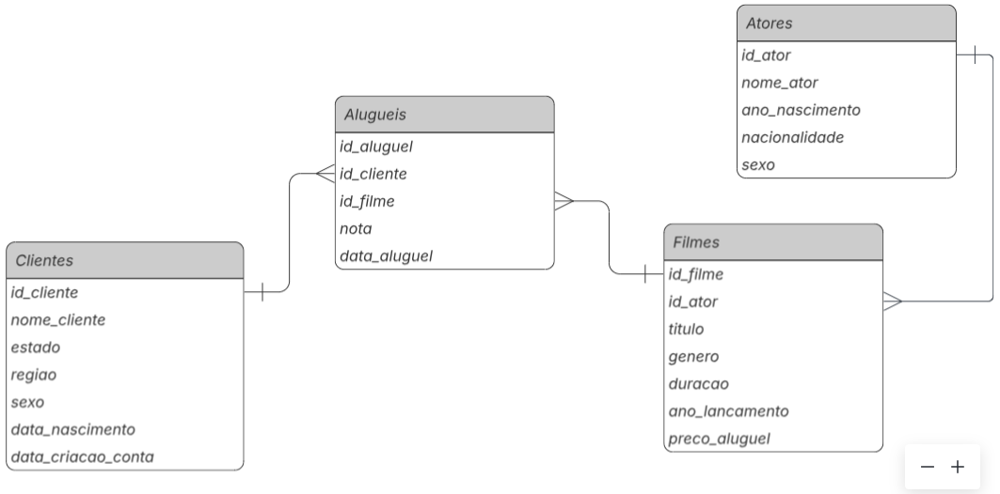
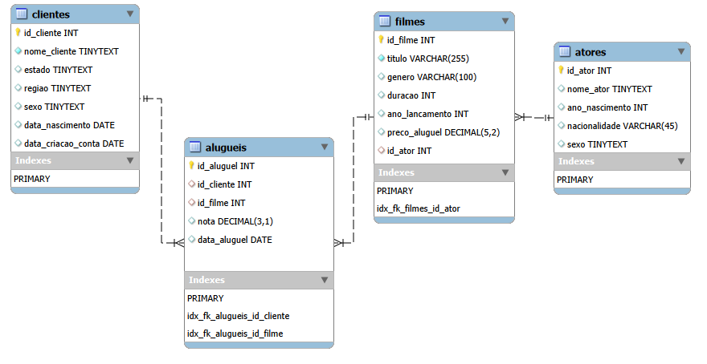

## Database Locadora

**Cenário:** 
Uma empresa de aluguel de filmes deseja saber quais os títulos com notas maiores que a média para entendimento de preferência do público.

### Query
[Agrupamento, Join, Filtros, View](Consulta/banco_dados/filmes/query)

### Modelo Conceitual

** A relação entre tabela Atores (1) -Filmes (N) devido coniderarmos apenas ator(atriz) principal. 

### Modelo Lógico

**Banco de Dados (BD):** 
-  alugueis.sql
-  atores.sql
-  clientes.sql
-  filmes.sql
 
**Aplicações**
  - Agrupamentos
  - Filtragem avançada
  - Joins
  - Subqueries
  - Criação de Views
 

