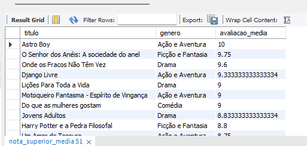
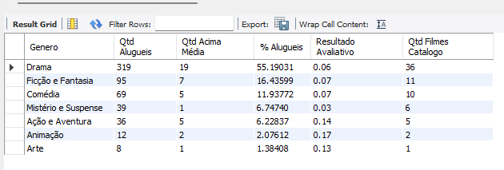
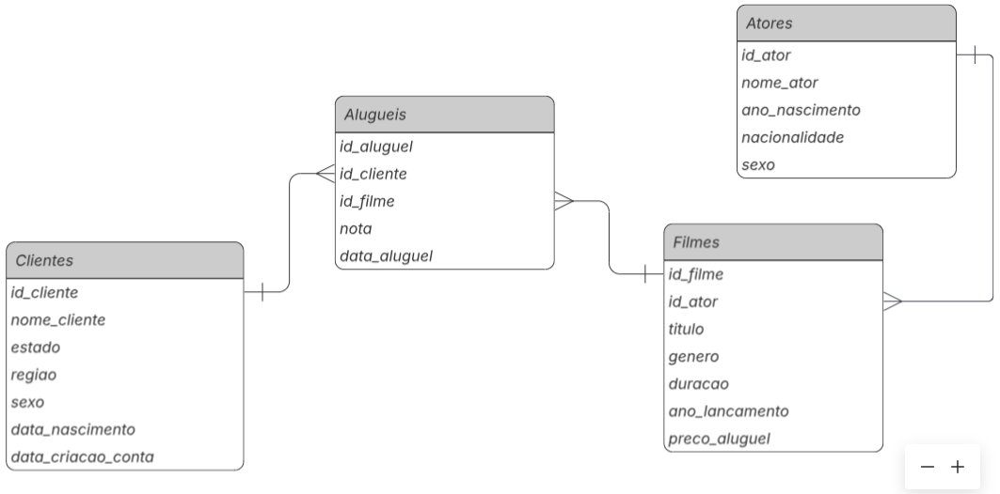
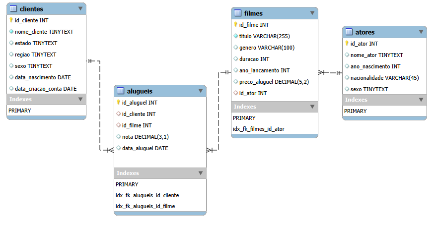

## Locadora [ Maximização de Vendas ]

### Case:
Uma empresa de aluguel de filmes deseja saber quais os títulos com notas maiores que a média para entendimento de preferência do público e elaboração de um plano de ação para maximização receita.

### Planejamento: 
1 - Levantamento de uma View otimizada para consulta de títulos com notas avaliativas acima da Média 
2 - Consulta com indicadores estratégicos por gênero para avaliar o cenário/oportunidades 
3 - Diagnóstico através da análise de dados 
4 - Elaboração de um plano de ação voltado ao objetivo do Negócio 

**SGBD [MySQL]** 

**Passo 1: View** 
Construção de uma view para consultas otimizadas para pronto consumo com informações operacionais de títulos com avaliação acima da média 
[Agrupamento, Join, Filtros, View](1_View) 

**Passo 2: Query** 
Consulta estratégica para entendimento por gênero com sua representatividade de alugueis, número de filmes e nota avaliativa 
[Função de Janela, Análise Dados](2_Query) 

**Passo 3: Diagnóstico** 
O Gênero Drama, apesar de conter mais da metade do número de alugueis, é o que contem o segundo pior resultado avaliativo do púbico - concentrando o maior número de filmes no catálogo, enquanto outros gêneros com maior nota avaliativa possuem menos disponibilidade de filmes em seu catálogo.

**Passo 4: Plano Ação Negócio** 
**1 -** Inserção de maior número de filmes de Animação (0.17), Ação e Aventura (0.14) e Arte (0.13) seguindo critérios e probabilidade segundo cenário mostrado nas notas avaliativas (levar em consideração a representatividade de alugueis desse gênero no mercado) 
**2 -** Revisão do Catálogo de Filmes do Gênero de Drama (55% de todos os alugueis) com descarte dos filmes com menor número de alugueis e notas avaliativas e inserção de filmes com características semelhantes e melhores notas (Clusterização) 
**3 -** O mesmo trabalho deve ser realizado para os gêneros Ficção e Fantasia e Comédia (Drama, Ficção e Fantasia, Comédia: + 80% dos alugueis realizados) 
**4 -** Revisão do gênero "Mistério e Suspense" que possui a pior nota avaiativa e possui mais filmes no catálogo que generos com melhor avaliação. 

### Modelo Conceitual:

** A relação entre tabela Atores (1) -Filmes (N) devido coniderarmos apenas ator(atriz) principal. 

### Modelo Lógico:

**Banco de Dados (BD):** 
-  alugueis.sql
-  atores.sql
-  clientes.sql
-  filmes.sql
 
**Aplicações:**
  - Agrupamentos
  - Filtragem avançada
  - Joins
  - Subqueries
  - Criação de Views
  - Função Janela
 

